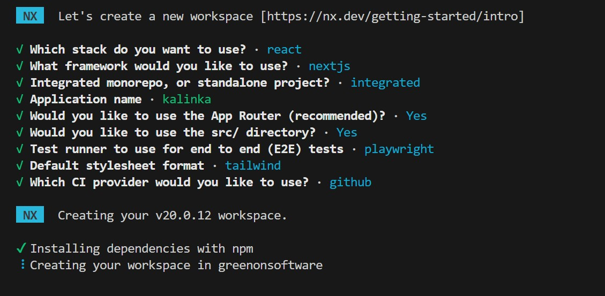

1. Create an empty repository with only a `README.md` file.
2. Run the following command:
   ```
   npx create-nx-workspace@latest greenonsoftware
   ```
3. Follow the setup steps:
   
4. Your project should now be ready.
5. To build, run, or develop, execute the following commands:
   ```
   cd greenonsoftware // Change to the project directory
   nx run kalinka:build // Production build only
   nx run kalinka:start // Builds and runs the production build
   nx run kalinka:dev   // Starts the development server
   ```

> It's important to change to the directory containing the `nx.json` file. Without this, commands will not work. Additionally, you no longer need to use `npx` before commands, as everything is configured in the `nx.json` file.
