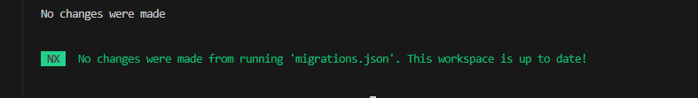

1. Navigate to the `greenonsoftware` directory where the `package.json` file is located.  
2. Verify the required Node.js version [compatibility](https://nx.dev/changelog). Install required Node version with [NVM](https://github.com/nvm-sh/nvm). In my case it is: `22.12.0`. Then install the latest version of NX globally:  
   ```bash
   npm install -g nx@latest
   ```  
   You can confirm the installation by typing:  
   ```bash
   nx --version
   ```  

   Example output:
   ```md
   Nx Version:
   - Local: v20.0.12
   - Global: v20.2.1
   ```

3. Install the latest NX version locally by running:  
   ```bash
   npm install nx@latest --save-dev
   ```  
   This will update the `nx` version in your `package.json`. For example, update:  
   ```json
   // From "v20.0.12" to:
   "nx": "^20.2.1"
   ```

4. Run the migration script:  
   ```bash
   npx nx migrate --run-migrations
   ```  
   Note: This process might take some time.

5. Ensure that the NX migration script supports your tech stack. Avoid making manual updates unless necessary! Doing so could disrupt package maintenance. If you need to update or install specific packages (e.g., utility libraries), do so manually as a last resort.

6. If the migration is successful, run:  
   ```bash
   npm install
   npx nx migrate
   ```  

7. If no further changes are needed, you’ll see an output like the following image. In some cases, it may prompt you with questions or make file changes.  

