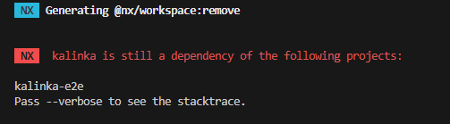
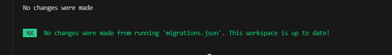
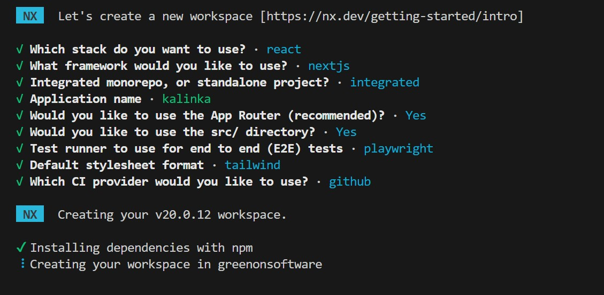

# All commands and stuff related to working with NX

## Connecting NX to the cloud?

1. If during any command there will be a `401` warning, then you can connect your project to the cloud.
2. Here is the command to init that process: `npx nx@latest init`.

## How to remove existing application?

1. Type a command: `nx g remove app-name`
   - If an application is dependency you need to remove connection first - usually remove project or import paths 
   
2. Confirm and remove app

## Adding a dependency (installing a package)

To install a packaged

```
npm i dep --save // for deps
// or
npm i dep --save-dev // for dev deps
// or
npm i dep --save --legacy-peer-deps
```

## How to create a local library?

1. To generate a library to be used internally in the monorepo, type `nx g @nx/js:lib libs/name-of-lib`.
2. Here is what I've picked up in CLI: 


3. Here you can display informations `nx show project name-of-stuff` or `nx show project todo --web`.

## How to create a new application?

1. Go to directory with `package.json`.
2. Type command: `nx g @nx/next:application apps/todo` to generate Next app.
3. To show list of projects you can type `nx show projects`.
4. To run all applications you can type following: `nx run-many -t dev`. If you want to run single app, you can do it like that: `nx dev kalinka`. [Here](https://nx.dev/getting-started/tutorials/react-monorepo-tutorial#testing-and-linting-running-multiple-tasks) is more about options.
5. To build an app you can type: `nx build app-name`.
6. To run prod builded app you can type: ``.

## How to migrate to new NX version?

1. Navigate to the `greenonsoftware` directory where the `package.json` file is located.  
2. Verify the required Node.js version [compatibility](https://nx.dev/changelog). Install required Node version with [NVM](https://github.com/nvm-sh/nvm). In my case it is: `22.12.0`. Then install the latest version of NX globally:  
   ```bash
   npm install -g nx@latest
   ```  
   You can confirm the installation by typing:  
   ```bash
   nx --version
   ```  

   Example output:
   ```md
   Nx Version:
   - Local: v20.0.12
   - Global: v20.2.1
   ```

3. Install the latest NX version locally by running:  
   ```bash
   npm install nx@latest --save-dev
   ```  
   This will update the `nx` version in your `package.json`. For example, update:  
   ```json
   // From "v20.0.12" to:
   "nx": "^20.2.1"
   ```

4. Run the migration script:  
   ```bash
   npx nx migrate --run-migrations
   ```  
   Note: This process might take some time.

5. Ensure that the NX migration script supports your tech stack. Avoid making manual updates unless necessary! Doing so could disrupt package maintenance. If you need to update or install specific packages (e.g., utility libraries), do so manually as a last resort.

6. If the migration is successful, run:  
   ```bash
   npm install
   npx nx migrate
   ```  

7. If no further changes are needed, you’ll see an output like the following image. In some cases, it may prompt you with questions or make file changes.  



## How this project (repository) has been created?

1. Create an empty repository with only a `README.md` file.
2. Run the following command:
   ```
   npx create-nx-workspace@latest greenonsoftware
   ```
3. Follow the setup steps:
   
4. Your project should now be ready.
5. To build, run, or develop, execute the following commands:
   ```
   cd greenonsoftware // Change to the project directory
   nx run kalinka:build // Production build only
   nx run kalinka:start // Builds and runs the production build
   nx run kalinka:dev   // Starts the development server
   ```

> It's important to change to the directory containing the `nx.json` file. Without this, commands will not work. Additionally, you no longer need to use `npx` before commands, as everything is configured in the `nx.json` file.

6. Running production build project locally `nx start todo`. Running it in development version `nx dev todo`.

## FAQs